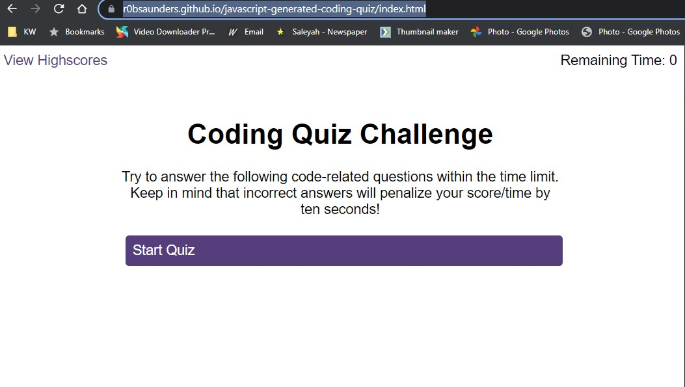

# Rob's JavaScript 'JavaScript' Quiz

## Description

I was tasked with building a timed multiple choice based quiz that can store a player's score at the end of the game.

## User Story

AS A coding boot camp student
I WANT to take a timed quiz on JavaScript fundamentals that stores high scores
SO THAT I can gauge my progress compared to my peers

## Acceptance Criteria

I have to create a quiz that runs in the browser featuring a timer, several questions with multiple choice answers and the ability to save a score, and view the highscores.

The exact criteria from the brief is:

* A start button that when clicked a timer starts and the first question appears.
 
  * Questions contain buttons for each answer.
  * 
  * When answer is clicked, the next question appears
  * 
  * If the answer clicked was incorrect then subtract time from the clock

* The quiz should end when all questions are answered or the timer reaches 0.

  * When the game ends, it should display their score and give the user the ability to save their initials and their score

It should look like the below:

## Usage

The gitHub repository is here: https://github.com/R0bsaunders/javascript-generated-coding-quiz

The live working version is here: https://r0bsaunders.github.io/javascript-generated-coding-quiz/index.html

The JavaScript for the main logic can be found here: 

The JavaScript for the highscore page can be found here: 

The questions are stored in a script file and can be found here: 

Here is a screenshot of the quiz front screen: 

Within the logic script, I declared a variable that allows the time limit to be changed with ease. 

The user clicks start quiz and the html dynamically loads the first question (randomly selected from the available questions) and the timer is started. Once a question is displayed, it is sliced out of the array and can't be displayed again. This is the method I chose to ensure the user is never presented the same question twice. This ability is part of the randomQuestion function found at line 67 of the logic.js file.

If a user selects a wrong answer, a penalty is applied in the form of a time reduction to the timer. I wanted the client to be able to easily change this penalty value so it is located at the top of the script as its own variable.

Separate audio files play depending on if the correct answer has been selected or not. 

Once the array containing the questions is empty (all questions have been displayed), the game ends and the time left is stored as a separate value so that it can be saved along with the user's initials. If the timer gets to zero, the game ends and the user score is 0. If the user selects an incorrect answer causing the timer to reach a number below 0, the game ends and the user's score is the negative value the game stopped at. 

If the user enters an initial and saves their score, it is saved to local storage.

The highscores can be viewed on the highscores page and this dynamically displays the scores saved in local storage, but sorted by highest score at the top and descending from their. If the user wants to clear all scores they can click 'Clear Highscores' and local storage is cleared.